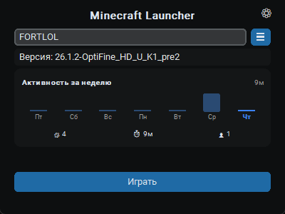
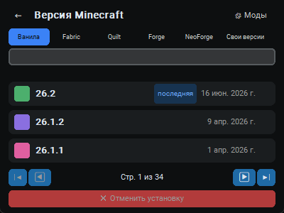
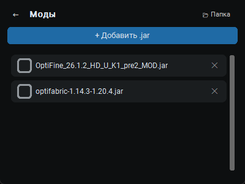

<div align="center">
  

  # Minecraft Launcher

  Простой, минималистичный лаунчер Майнкрафта на Python.

  [](https://www.python.org/)
  [](#)
  [](LICENSE)
  [](https://github.com/Vladimir-Rodichkin/Minecraft-Launcher/commits/main)
  [](#)
  [](https://github.com/TomSchimansky/CustomTkinter)
</div>

---

## Возможности

- Установка Fabric / Quilt / Forge / NeoForge прямо из лаунчера, в один клик по версии
- Отдельная вкладка для вручную установленных версий
- Менеджер модов
- Настройки: свой путь к Java, объём RAM, произвольные аргументы JVM

## Скриншоты

<table>
<tr>
<td align="center"><br/><sub>Главный экран</sub></td>
<td align="center"><br/><sub>Выбор версии и загрузчика</sub></td>
<td align="center"><br/><sub>Менеджер модов</sub></td>
</tr>
</table>

## Установка

### Готовый .exe

Скачайте `MinecraftLauncher.exe` со страницы [Releases](https://github.com/Vladimir-Rodichkin/Minecraft-Launcher/releases).

### Из исходников

```bash
git clone https://github.com/Vladimir-Rodichkin/Minecraft-Launcher.git
cd Minecraft-Launcher
python -m venv .venv
.venv\Scripts\activate
pip install -r requirements.txt
python main.py
```

## Сборка .exe самостоятельно

```bash
pip install pyinstaller
pyinstaller --onefile --windowed --name "MinecraftLauncher" --icon assets/icon.ico --add-data "assets;assets" main.py
```

Готовый файл появится в `dist/MinecraftLauncher.exe`.

## Структура проекта

```
├── main.py            # сборка интерфейса, точка входа
├── state.py           # общие константы и состояние приложения
├── storage.py         # config.json: ники, настройки, статистика
├── java_runtime.py    # поиск и установка Java-рантайма
├── launcher.py        # запуск/остановка игры, логи
├── versions.py        # выбор версии, загрузчики модов, пагинация
├── mods.py            # менеджер модов
├── nicknames.py       # страница никнеймов
├── settings_page.py   # страница настроек
├── activity.py        # график активности за неделю
├── navigation.py      # переключение между экранами
└── assets/            # иконка и скриншоты
```

## Технологии

- [CustomTkinter](https://github.com/TomSchimansky/CustomTkinter) — интерфейс
- [minecraft-launcher-lib](https://codeberg.org/JakobDev/minecraft-launcher-lib) — установка и запуск Minecraft, загрузчики модов, Java-рантаймы
- [PyInstaller](https://pyinstaller.org/) — сборка в `.exe`

## Лицензия

Проект распространяется под лицензией [MIT](LICENSE).
